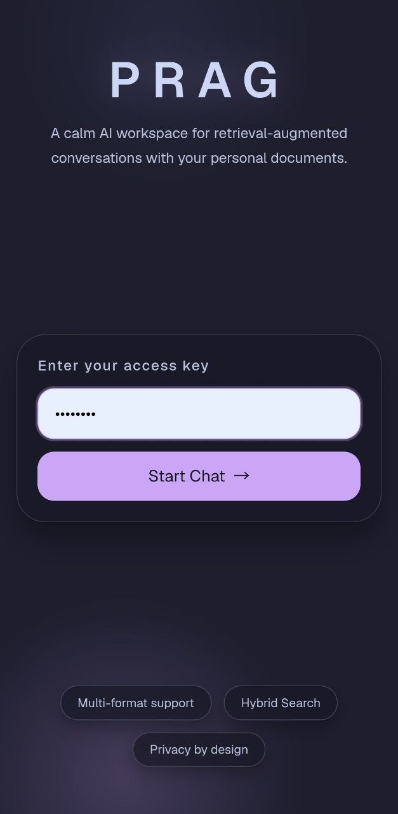
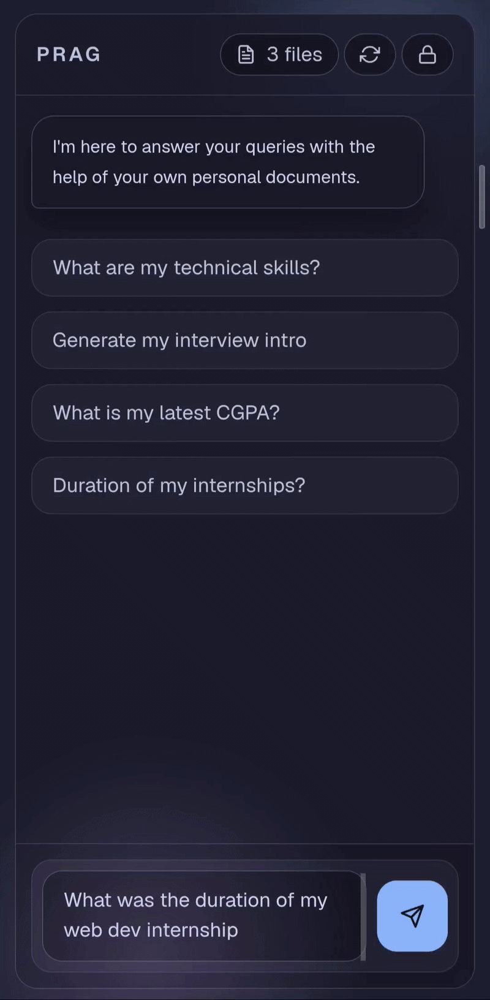

# PRAG Web Client

A React frontend for **[PRAG](https://github.com/subrat-dwi/prag-personal-rag)**, a retrieval-augmented chat interface for querying personal documents. Built as an installable PWA with offline-capable shell support.

## Demo

<p align="center">
  
  
</p>

## Features

- **Access-key authentication** — gated entry via a single access key verified against the backend `/auth` endpoint
- **Conversational chat interface** — chat bubble UI with typing indicators and source attribution
- **Indexed files browser** — view all currently indexed documents with direct links to their Google Drive location
- **One-click sync** — trigger re-indexing of new/changed/deleted Drive files via `/sync`
- **Session lock** — exit the chat session and return to the landing page
- **PWA support** — installable on desktop and mobile, with native app-like behavior

## Tech Stack

- **React** — UI library
- **Vite** — build tool and dev server
- **Tailwind CSS** — styling
- **vite-plugin-pwa** — PWA/service worker support

## Project Structure
```
prag-web/
├── src
│   ├── App.jsx                 # Root component, handles auth state and page switching
│   ├── component
│   │   ├── LandingPage.jsx      # Intro + access key authentication
│   │   ├── ChatInterface.jsx    # Main chat UI (files dropdown, sync, lock, messages)
│   │   ├── FilesDropdown.jsx    # Indexed files list with Drive links
│   │   ├── MessageBubble.jsx    # Individual chat message rendering
│   │   ├── SourcePill.jsx       # Source citation chip
│   │   ├── TypingIndicator.jsx  # Animated "typing" indicator
│   │   └── Spinner.jsx          # Loading spinner
│   ├── hooks
│   │   └── useChat.js           # Chat state management and API interaction
│   └── utils
│       └── api.js               # API client / request helpers
├── public/                       # Static assets
└── vite.config.js
```

## Prerequisites

- Node.js (LTS recommended)
- A running instance of the [PRAG backend](#) with `/auth`, `/files`, `/sync`, and `/query` endpoints accessible

## Getting Started

### 1. Clone and install dependencies

```bash
git clone <repo-url>
cd prag-web-client
npm install
```

### 2. Configure environment variables

Create a `.env` file in the root directory:

```env
VITE_PRAG_API_URL_PROD=https://your-backend-url.com  # for production
```

### 3. Run the development server

```bash
npm run dev
```

The app will be available at `http://localhost:5173`.

### 4. Build for production

```bash
npm run build
```

## How It Works

1. **Landing page** — displays a brief introduction to PRAG and prompts the user for an access key
2. **Authentication** — the access key is sent to the backend `/auth` endpoint for verification against a server-side password
3. **Chat interface** — on successful auth, the user is taken to the chat view, which:
   - Fetches the list of indexed files from `/files` on load
   - Allows triggering a Drive sync via `/sync`
   - Sends user queries to `/query` and renders responses with source citations
   - Provides a lock button to clear the session and return to the landing page

## Deployment

This is a static SPA and can be deployed to any static hosting provider (Vercel, Netlify, GitHub Pages, etc.). Ensure `VITE_PRAG_API_URL_PROD` is set correctly for the target environment at build time.

## Contributing

Contributions, suggestions, and feedback are welcome! Whether it's fixing a bug, improving documentation, or proposing a new feature, feel free to open an issue or submit a pull request.

> If you find this project useful or interesting, consider giving it a ⭐ — it helps others discover it and motivates further development.

## License

MIT